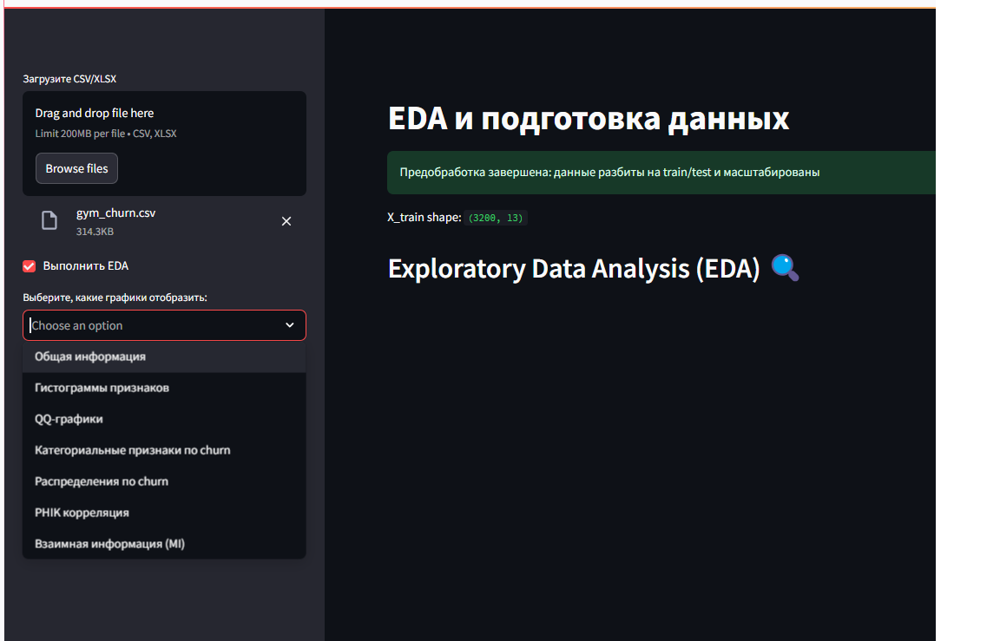
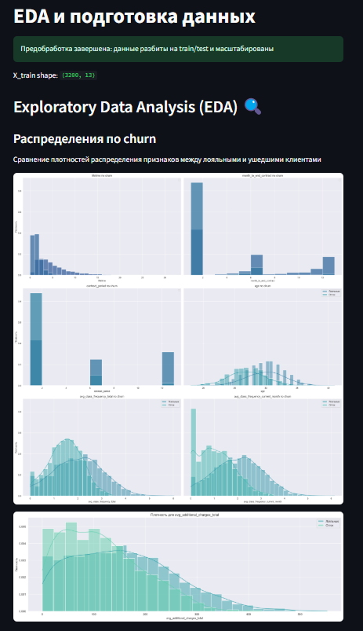
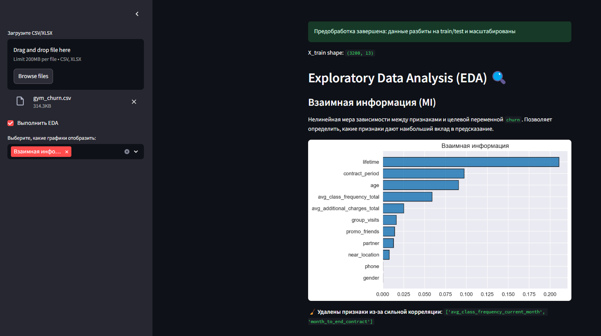
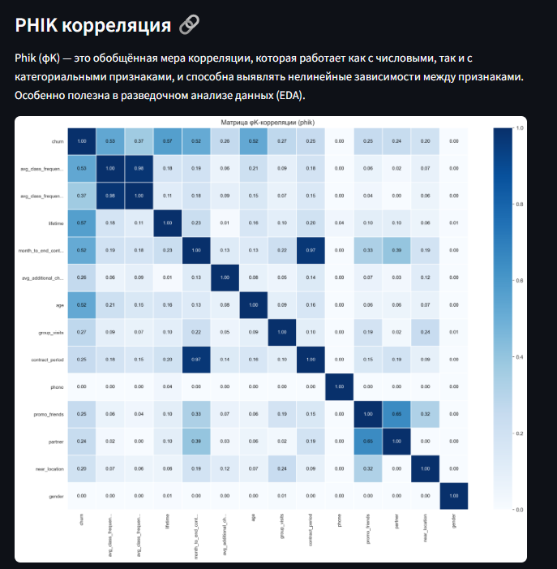
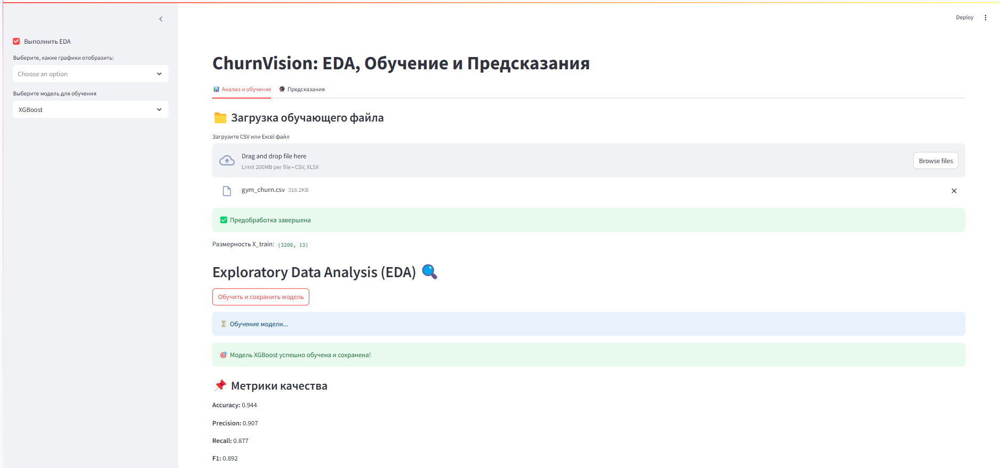
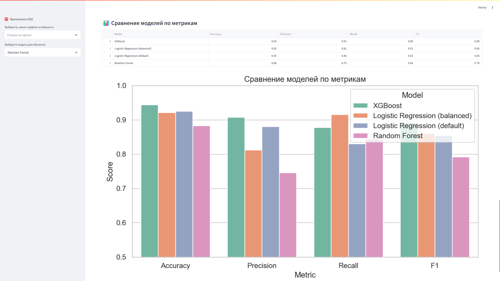
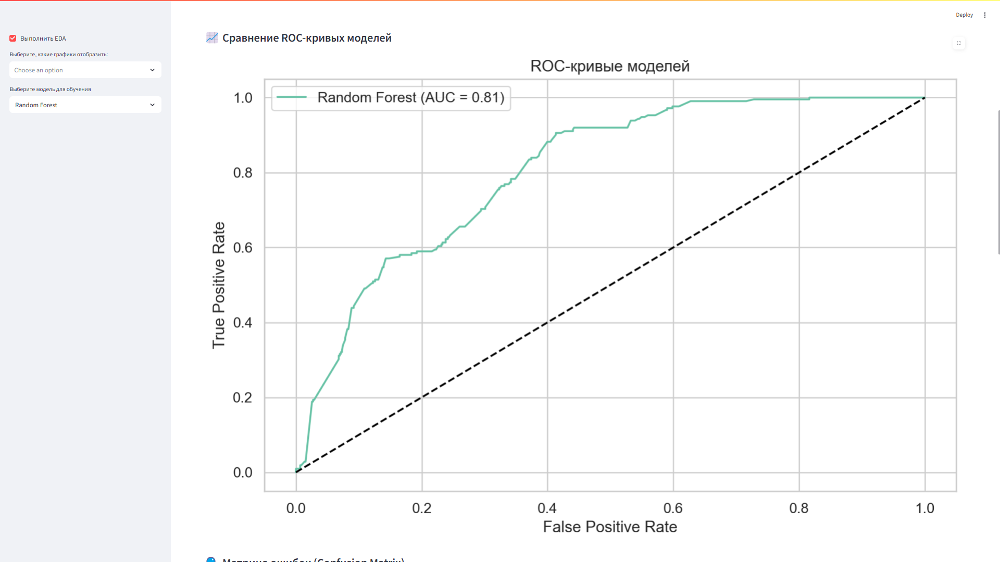
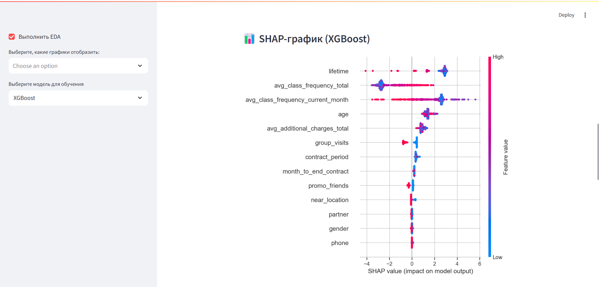

# ChurnVision – Прогнозирование клиентского оттока


**ChurnVision** — это веб-приложение для анализа пользовательских данных и прогнозирования вероятности оттока клиентов с использованием моделей машинного обучения. Проект помогает бизнесу своевременно выявлять риски и принимать решения для удержания клиентов.

## 👥 Команда проекта

| ФИО              | Группа     | GitHub логин   |
|------------------|------------|----------------|
| Никита Епанчинцев| ЭУ-201     | nikytap07      |
| Вдовин Игорь     | ЭУ-201     | Igor74532      |


## 📄 Техническое задание

[Открыть Техническое задание](./docs/Техническое%20задание.md)

## 🛠️ Стек технологий

- **Интерфейс:** Streamlit
- **Анализ данных:** Pandas, NumPy, Seaborn
- **ML:** scikit-learn, SHAP, XGBoost
- **Хранение данных:** 	CSV-файлы, (в перспективе: SQLite/PostgreSQL)
- **Визуализация:** 	Plotly, Matplotlib
- **Деплой:** 	Streamlit CLI / Streamlit Cloud

## 🚀 Запуск проекта

## Порядок запуска

1. **Создать и активировать виртуальное окружение**:

   ```bash
   python3 -m venv venv
   source venv/bin/activate
   ```

2. **Установить зависимости**:

   ```bash
   pip install --upgrade pip
   pip install -r requirements.txt
   ```

3. **Запустить приложение Streamlit**:

   ```bash
   streamlit run app.py
   ```
   
   ## 📁 Структура проекта

| Файл / Папка         | Назначение                                                       |
|----------------------|------------------------------------------------------------------|
| `app.py`             | Основной интерфейс Streamlit                                     |
| `preprocess.py`      | Подготовка данных, отбор признаков                              |
| `eda.py`             | Визуализация, SHAP-графики, корреляции                          |
| `model.py`           | Обучение моделей и сохранение `.pkl`                            |
| `clustering.py`      | Кластеризация пользователей, визуализация                       |
| `requirements.txt`   | Зависимости проекта                                              |
| `README.md`          | Инструкция по установке и запуску                               |
| `data/`              | Пример входных данных                                            |
| `models/`            | Сохранённые модели (`.pkl`)                                      |
| `docs/`              | Документация, включая техническое задание                       |
| `notebooks/`         | Jupyter Notebook (Для демонстрации)                          |

## 📸 Примеры интерфейса

### 🔍 Общая информация и гистограммы


### 📈 Визуализация распределений по целевой переменной


### 🧩 Взаимная информация (Mutual Information)


### 🔍 PHIK-корреляция


## 🧠 Логика работы приложения

После запуска `streamlit run app.py` открывается веб-интерфейс, который позволяет:

1. **Загрузить CSV или XLSX-файл** с пользовательскими данными (например, `gym_churn.csv`).
2. ✅ **Выполнить EDA (исследовательский анализ данных)**:
   - Отображение общей информации по датасету (размер, типы, пропуски).
   - Построение гистограмм, QQ-графиков, распределений по целевой переменной `churn`.
   - Визуализация корреляций (в том числе PHIK), взаимной информации.
   - Фильтрация высоко коррелированных признаков.

3. 🧪 **Предобработка данных**:
   - Преобразование признаков;
   - Масштабирование (`StandardScaler`);
   - Разделение на обучающую и тестовую выборки.

4. (В перспективе: обучение модели и прогнозирование оттока по новым данным.)

Каждый этап можно запускать отдельно с помощью флажков и чекбоксов.

## 🤖 Обучение моделей и прогнозирование (`model.py`)

Модуль `model.py` реализует ключевую бизнес-логику машинного обучения: обучение, валидацию, сохранение и предсказание по новым данным.

### 📥 Требования к данным

Файл для обучения должен содержать колонку `churn` (целевой признак) и следующие обязательные признаки:

**Категориальные признаки:**
- `gender` — пол клиента
- `near_location` — живёт или работает рядом
- `partner` — работает в компании-партнёре
- `promo_friends` — приглашён другом по акции
- `phone` — есть ли контактный номер
- `group_visits` — посещал ли групповые занятия

**Числовые признаки:**
- `lifetime` — количество месяцев с момента первого визита
- `month_to_end_contract` — число месяцев до окончания контракта
- `contract_period` — срок действия абонемента (в месяцах)
- `age` — возраст клиента
- `avg_class_frequency_total` — средняя частота посещений в неделю за всё время
- `avg_class_frequency_current_month` — частота в текущем месяце
- `avg_additional_charges_total` — сумма доплат за услуги

> ✅ Все имена колонок автоматически приводятся к нижнему регистру и обрезаются от лишних пробелов.

---

### 🧪 Как работает обучение

После загрузки файла с `churn`, приложение автоматически:
1. Делит данные на `train`/`test` (80/20) с учетом стратификации.
2. Масштабирует числовые признаки через `StandardScaler`.
3. Обучает модель (выбирается пользователем в интерфейсе).
4. Сохраняет `.pkl` файл модели и `scaler.pkl`.

Доступные модели:
- `Logistic Regression (balanced)`
- `Logistic Regression (default)`
- `Random Forest` (с GridSearchCV)
- `XGBoost` (с GridSearchCV)

📸 **Пример: загрузка файла и успешное завершение обучения**  
__

---

### 📊 Выводимые метрики

После обучения отображаются основные метрики качества:

| Метрика  | Описание |
|----------|----------|
| Accuracy | Доля верных предсказаний |
| Precision | Доля верных предсказаний среди предсказанных `churn=1` |
| Recall | Доля найденных `churn=1` среди всех реально ушедших |
| F1 Score | Гармоническое среднее между Precision и Recall |

📸 __

---

### 📈 Визуализация моделей

После обучения строятся:
- **ROC-кривые** для всех обученных моделей;
- **SHAP Summary Plot** для XGBoost (если выбран).

📸 __
📸 __

---

### 🔮 Предсказание

Во вкладке **"🔮 Предсказания"** пользователь может:
1. Загрузить **новый CSV или Excel файл без колонки `churn`**.
2. Выбрать ранее обученную `.pkl` модель.
3. Получить предсказания:
   - `prediction` — 1 (уйдёт), 0 (останется);
   - `probability` — вероятность оттока.

📸 __

---

### 💾 Хранение результатов

Все обученные модели сохраняются в папке `models/`:
- `Logistic_Regression.pkl`
- `XGBoost.pkl`
- `scaler.pkl` — масштабировщик признаков

Файл с результатами можно скачать в формате `.csv` по кнопке **"📥 Скачать результат"**.

📸 __
